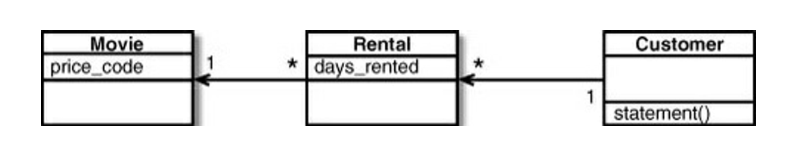
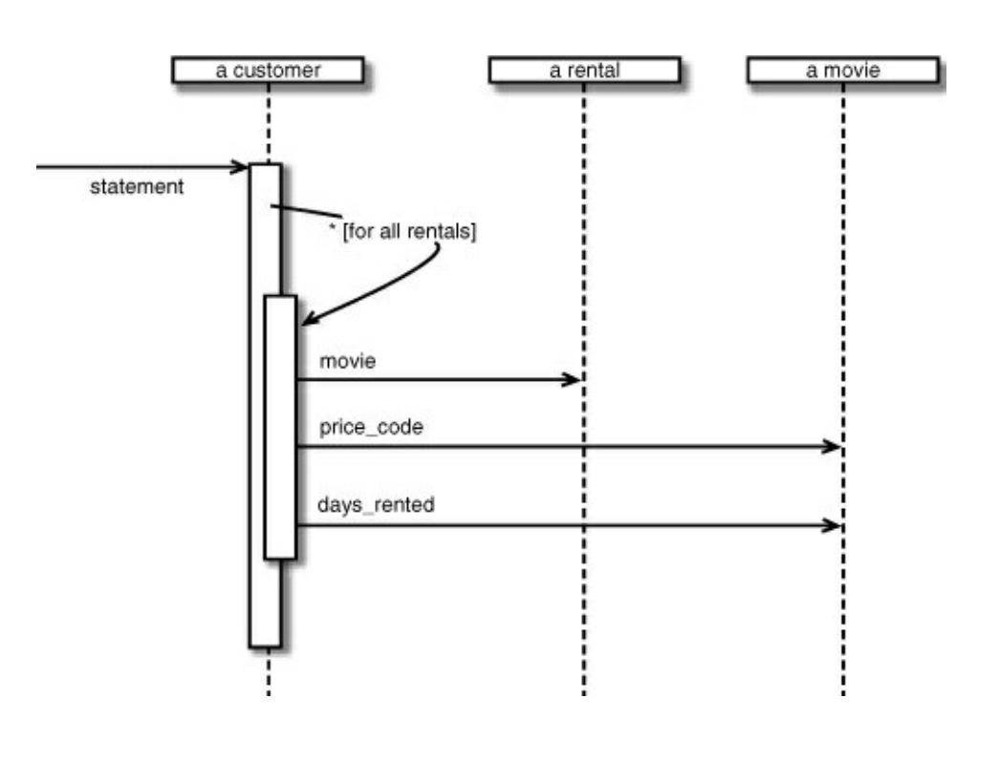

# Chapter 1: Refactoring: A First Example

Rather than starting with a theoretical introduction, let's start with an example.

## Starting point



```rb
class Movie
  REGULAR = 0
  NEW_RELEASE = 1
  CHILDRENS = 2

  attr_reader :title, :price_code

  def initialize(title, price_code)
    @title = title
    @price_code = price_code
  end
end

```

```rb
class Rental
  attr_reader :movie, :days_rented

  def initialize(movie, days_rented)
    @movie = movie
    @days_rented = days_rented
  end
end
```

```rb
class Customer
  attr_reader :name

  def initialize(name)
    @name = name
    @rentals = []
  end

  def add_rental(rental)
    @rentals << rental
  end

  def statement
    total_amount = 0
    frequent_renter_points = 0
    result = "Rental Record for #{@name}\n"

    @rentals.each do |rental|
      this_amount = 0

      # determine amount for each rental
      case rental.movie.price_code
      when Movie::REGULAR
        this_amount += 2
        if rental.days_rented > 2
          this_amount += (rental.days_rented - 2) * 1.5
        end
      when Movie::NEW_RELEASE
        this_amount += rental.days_rented * 3
      when Movie::CHILDRENS
        this_amount += 1.5
        if rental.days_rented > 3
          this_amount += (rental.days_rented - 3) * 1.5
        end
      end

      # add frequent renter points
      frequent_renter_points += 1
      # add bonus for a two-day new release rental
      if rental.movie.price_code == Movie::NEW_RELEASE && rental.days_rented > 1
        frequent_renter_points += 1
      end

      # show figures for this rental
      result += "\t#{rental.movie.title}\t#{this_amount}\n"
      total_amount += this_amount
    end

    # add footer lines
    result += "Amount owed is #{total_amount}\n"
    result += "You earned #{frequent_renter_points} frequent renter points"

    result
  end
end
```

The code did the job, but then we got a new requirement:
```
We need to add a new method that will generate an HTML statement. This statement should show the rental record for a customer in an HTML table. It should include the customer name, the movie titles, the rental periods, and the rental amounts. It should also include the total amount owed and the number of frequent renter points earned.
```

### Starting the refactor

1. Ensure that you have a solid suite of tests in place. This will help you ensure that you don't break any existing functionality as you refactor the code.
2. Identify areas of the code that are in need of refactoring. Look for areas that are overly complex, difficult to modify, or prone to errors.
3. Start by making small, incremental changes to the codebase. Each change should improve the design and make the code easier to understand and modify.


### Decomposing and Redistributing the Statement

Method The obvious first target of my attention is the overly long statement method.

